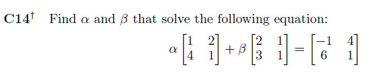

**_Problem is taken from A First Course in Linear Algebra, Chapter M, Matrices_**

**_A:_**

**_Using Matrix Scalar Multiplication_**

$\alpha\left[\begin{array}{cc}1 & 2\\4 & 1\end{array}\right] + \beta\left[\begin{array}{cc}2 & 1\\3 & 1\end{array}\right] = \left[\begin{array}{cc}-1 & 4\\6 & 1\end{array}\right]$

**_Converts to_**
$\left[\begin{array}{cc}1\alpha & 2\alpha\\4\alpha & 1\alpha\end{array}\right] + \left[\begin{array}{cc}2\beta & 1\beta\\3\beta & 1\beta\end{array}\right] = \left[\begin{array}{cc}-1 & 4\\6 & 1\end{array}\right]$

**_Using Matrix Addition_**

$\left[\begin{array}{cc}1\alpha + 2\beta & 2\alpha + 1\beta\\4\alpha + 3\beta & 1\alpha + 1\beta\end{array}\right]  = \left[\begin{array}{cc}-1 & 4\\6 & 1\end{array}\right]$

**_This results in four equations_**
$1\alpha + 2\beta = -1$, $2\alpha + 1\beta = 4$, $4\alpha + 3\beta = 6$, $1\alpha + 1\beta = 1$

**_Solving two equations_**
$1\alpha + 2\beta = -1$, $2\alpha + 1\beta = 4$

$-2*(1\alpha + 2\beta) = -1 * -2$, $2\alpha + 1\beta = 4$

$-2\alpha - 4\beta = 2$, $2\alpha + 1\beta = 4$

$-2\alpha - 4\beta = 2$, $2\alpha + 1\beta = 4$

$-3\beta = 6$

$\beta = -2$

**_Substituting beta value_**

$2\alpha + 1\beta = 4$

$2\alpha + 1(-2) = 4$

$2(\alpha - 1) = 4$

$(\alpha - 1) = 2$

$\alpha = 3$

**_Substituting values of alpha and beta_**

$\left[\begin{array}{cc}1(3) + 2(-2) & 2(3) + 1(-2)\\4(3) + 3(-2) & 1(3) + 1(-2)\end{array}\right]  = \left[\begin{array}{cc}-1 & 4\\6 & 1\end{array}\right]$

$\left[\begin{array}{cc}(3 -4) & (6 -2)\\(12 - 6) & (3 - 2)\end{array}\right]  = \left[\begin{array}{cc}-1 & 4\\6 & 1\end{array}\right]$

$\left[\begin{array}{cc}-1 & 4\\6 & 1\end{array}\right]  = \left[\begin{array}{cc}-1 & 4\\6 & 1\end{array}\right]$
